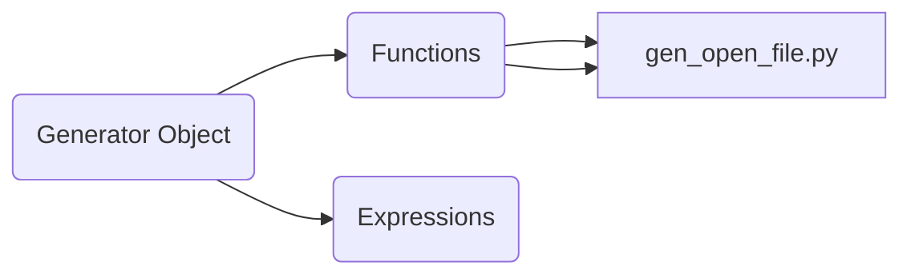

# Generator Tutorials
This repository will go over the main ways we intend to use generators when working with different types of lists or iterables in python.

#### Purpose
The purpose of using generators is that they help us deal with one object in memory at a time, when we want to perform operations which require a list of objects to be used we will often try to use a generator to reduce the memory consumption.  Since Generators don't hold in memeory the whole array they just operate on the individual elements of an iterable themselves.

#### Start
Go through the different files and see how arrays can be adopted to be turned into generator arrayts and how functions can be turned into generator functions.